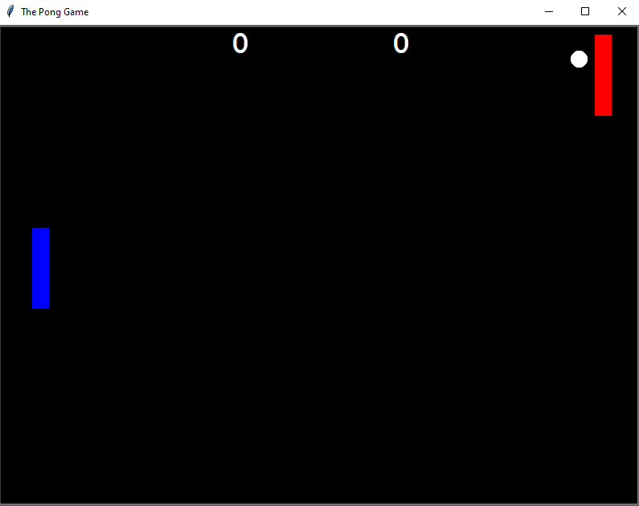
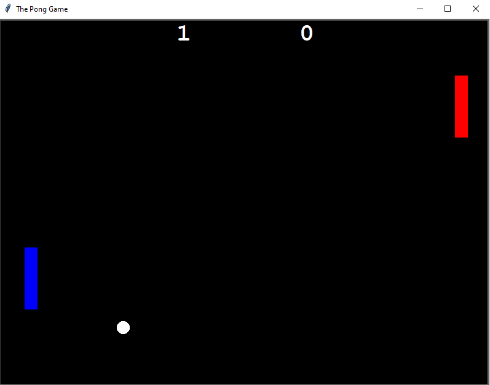
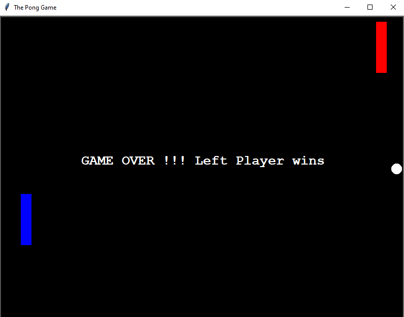

# PongGame Using Python

## `Gameplay`  

 Right side player uses UP and DOWN arrow keys to control the 
movement of the Paddle. Left side player uses W and S keys to control
the paddle. A player earns a point if other player misses to hit
the ball with paddle. First player to reach 2 points wins the game

## `Screenshots`  

